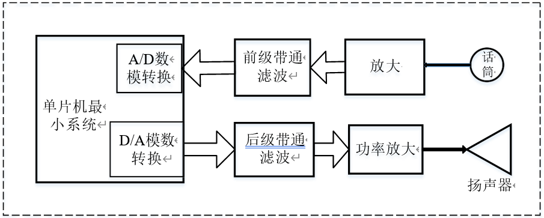

>   实验一 数字化语音采集回放系统

# 一、 实验目的

>   学习理解单片机的设计流程，进一步掌握音频功率放大器的制作，
>   同时掌握数模转换器和模数转换器的使用，实现语音信号的数字化采集、存储和回放。

# 二、 实验任务

>   设计并制作一个数字化语音存储与回放系统，包括语音信号的调理、采集、存储和回放。基于语音信号的数字化存储与恢复原理，采用A/D、D/A
>   转换技术，完成了对语音信号的数字化存储与回放功能。整个设计由前级信号处理、后级语音回放组成，单片机完成信号的存储、AD/DA
>   数据采集和输出，模拟电路完成前级信号处理和后级语音回放。

# 三、 实验要求

1.  基本要求

2.  带通滤波器：通带为 300Hz～3.4kHz ；

3.  ADC：采样频率 f s≥8kHz，字长≥8 位；

4.  语音存储时间≥10 秒；

5.  DAC：变换频率 f c≥8kHz，字长≥8 位；

6.  回放语音质量良好。

7.  发挥部分

    在保证语音质量的前提下：

8.  减少系统噪声电平，回放的语音清晰；

9.  增加掉电存储数据不丢失功能，再次上电后系统可直接运行上一次存储的语言数据。

    （2）增加回放音量手动控制功能，可调节回放音量大小；

# 四、 实验原理

>   整个系统主要由前级信号处理与后级语音回放组成。其中差分放大、前级带通滤波和
>   A/D 转换三个模块构成了前级信号处理部分，后级语音回放由 D/A   转换、后级带通滤波和功率放大三个模块构成。整体的设计框图如下图 1   所示:

>   实验中具体操作流程如下：
>   按键 K1 按下，定时器 T1 开始 10s
>   计时，系统开始采集语言信号，并且进行存储。定时器 T1
>   中断结束后，从存储器中读入存储的采样值，输出至
>   DAC，经过滤波、放大后经扬声器输出。
